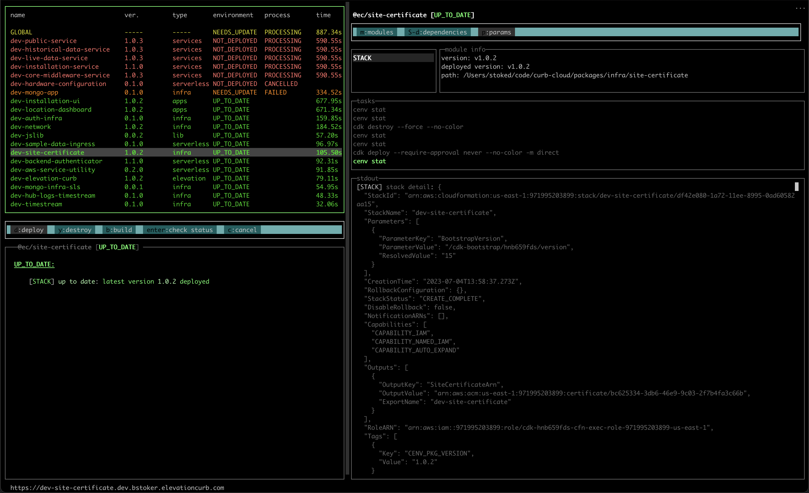

# cenv

<p align="center">
  <a href="https://cenv-mono-artifacts.s3.amazonaws.com/cenv-deploy-curb-cloud.gif" target="_blank"><picture>
  <source media="(prefers-color-scheme: dark)" srcset="./assets/cenv-deploy.png">
  
</picture></a>
</p>
  <p align="center">A well considered cli and <a href="http://nodejs.org" target="_blank">Node.js</a> library for helping manage application, infrastructure, and configuration management.</p>
  <p align="center">
    <a href="https://nodejs.org/en/download/" target="_blank"></a>&nbsp
    <a href="https://www.typescriptlang.org/" target="_blank"></a>&nbsp
    <a href="https://aws.amazon.com/cdk/" target="_blank"></a>
  </p>
  <!--[](https://opencollective.com/stoked-cenv#backer)
  [](https://opencollective.com/stoked-cenv#sponsor)-->

##  overview

Cenv inspects your packages and looks for specific conventions to identify `cenv modules` within each package. There are currently 5 different types of cenv modules, PARAMS, DOCKER, and STACK. A package must have at least one cenv module in order to take advantage of the cenv tool.

The PARAMS module leverages AWS AppConfig and AWS Parameter Store to manage application parameter configuration. The DOCKER module provides a mechanism to create an AWS ECR repository for the package containers and build and push the packages containers to the repo. Finally, the STACK module uses AWS Cdk to deploy cloudformation stacks representing the infrastructure and applications contained in the packages.


### pre-requisites

- [node](https://nodejs.org/en/download/)
- [python](https://www.python.org/downloads/)
- [Yarn](https://classic.yarnpkg.com/en/docs/install/#debian-stable)
- [aws cdk](https://aws.amazon.com/cdk/) 
- [docker](https://www.docker.com/products/docker-desktop)

## Getting Started

install the cli:

```shell
#npm
npm i -g @stoked-cenv/cli 
```
or

```shell
#yarn
yarn global add @stoked-cenv/cli 
```

### configuring aws

```shell
 cenv configure
 ```
<picture>
  <source media="(prefers-color-scheme: dark)" srcset="https://cenv-mono-artifacts.s3.amazonaws.com/cenv+config.gif" >
  
</picture>

```shell
# aws profile used to access the aws account you are deploying to.. if one doesn't already exist run "aws configure" first
AWS_PROFILE: (stoked)

# environment region
AWS_REGION: (us-east-1)

# environment name
ENV: (dev)

# this value needs to be the same as your assigned [subdomain].elevationcurb.com hosted zone for AWS deployments
ROOT_DOMAIN: (bstoker.stokedconsulting.com)
```

##### full stack example project coming soon!

### cenv-mono contents: the packages

This monorepo contains 3 packages which will be explained here. The packages are cli, lib, params, and ui.

The cli package contains the code for the end user command line interface tool.

The lib package contains the library code that can be consumed by external libraries to manage cenv parameters in their application stacks.

The ui package contains the ui code for the cli built on https://github.com/chjj/blessed.

### support

<p align="center">
<a href="http://stokedconsulting.com/" target="blank">
<picture>
  <source media="(prefers-color-scheme: dark)" srcset="./assets/sc-logo.white.png">
  
</picture>
</a>
</p>


Call your congressperson. When that doesn't work contact [Brian Stoker](mailto:b@stokedconsulting.com).

### license

[MIT Licensed](https://opensource.org/license/mit/)
